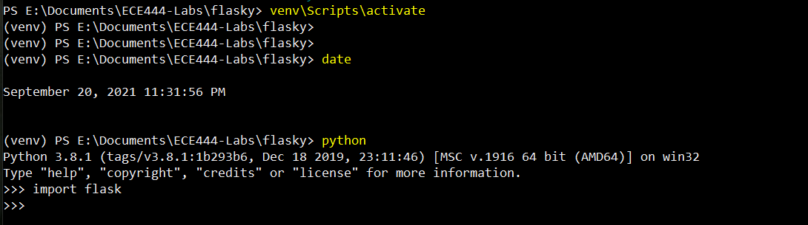
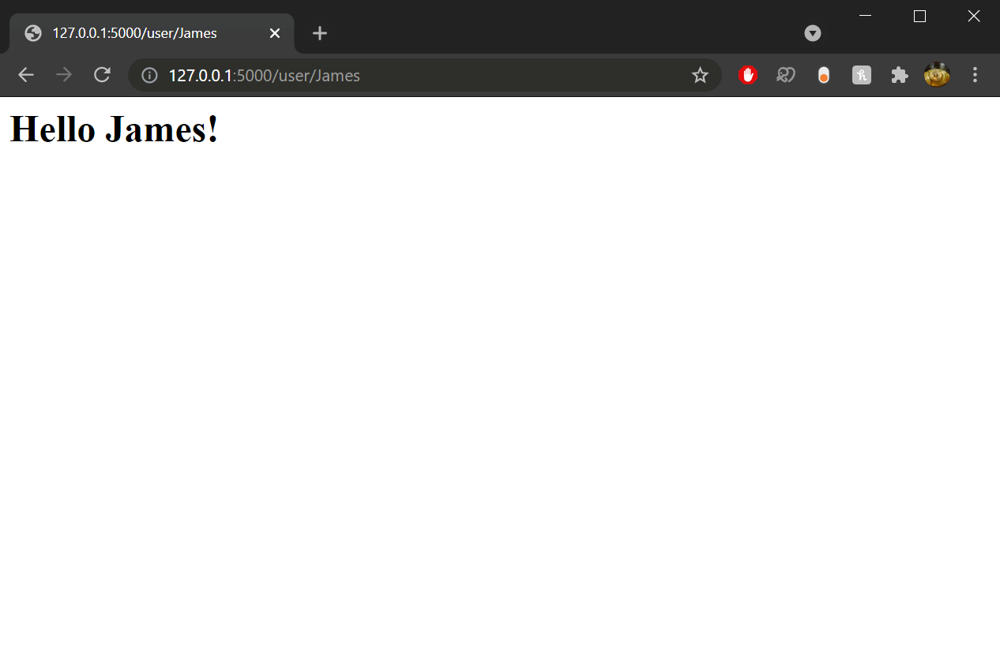
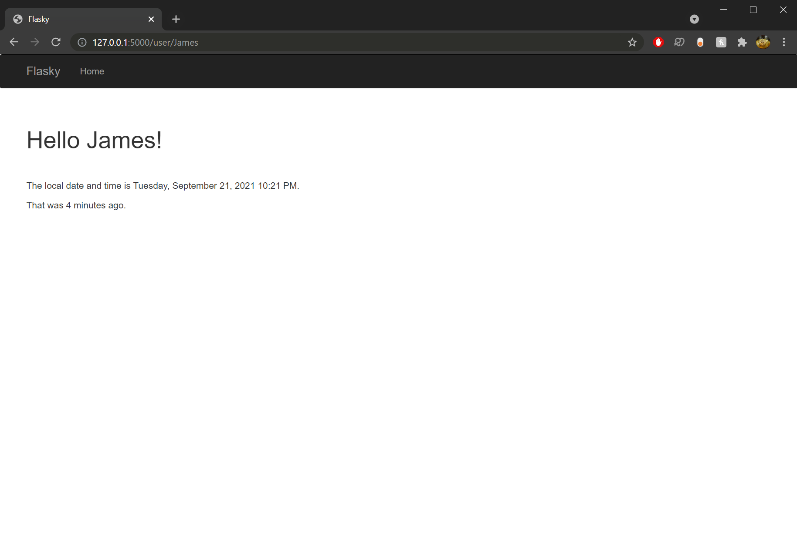
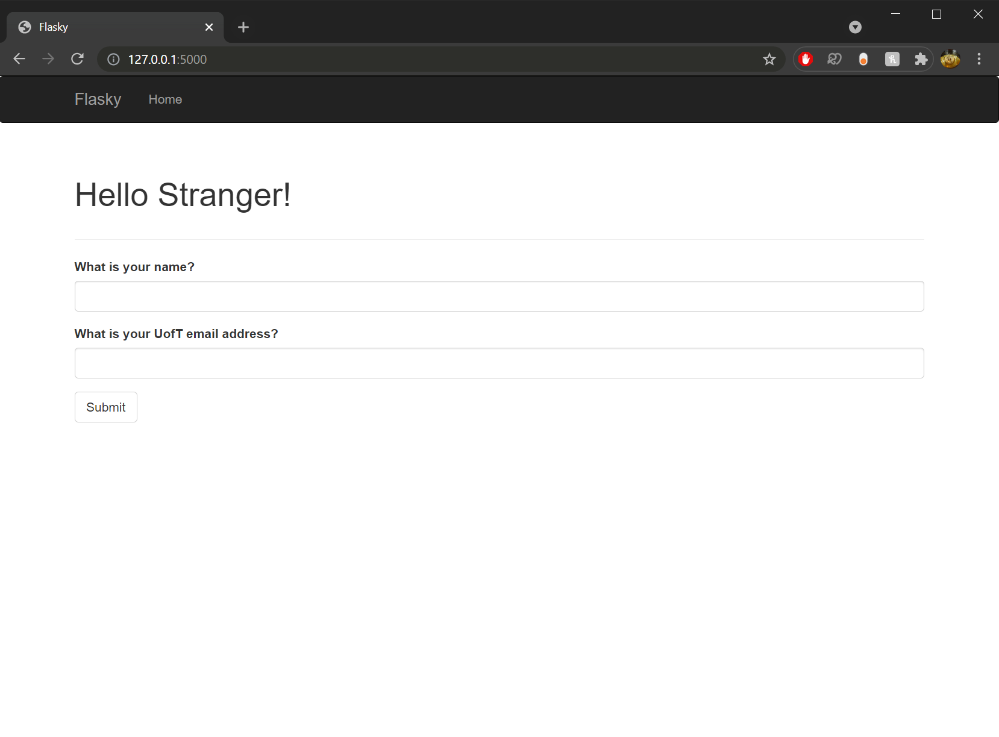
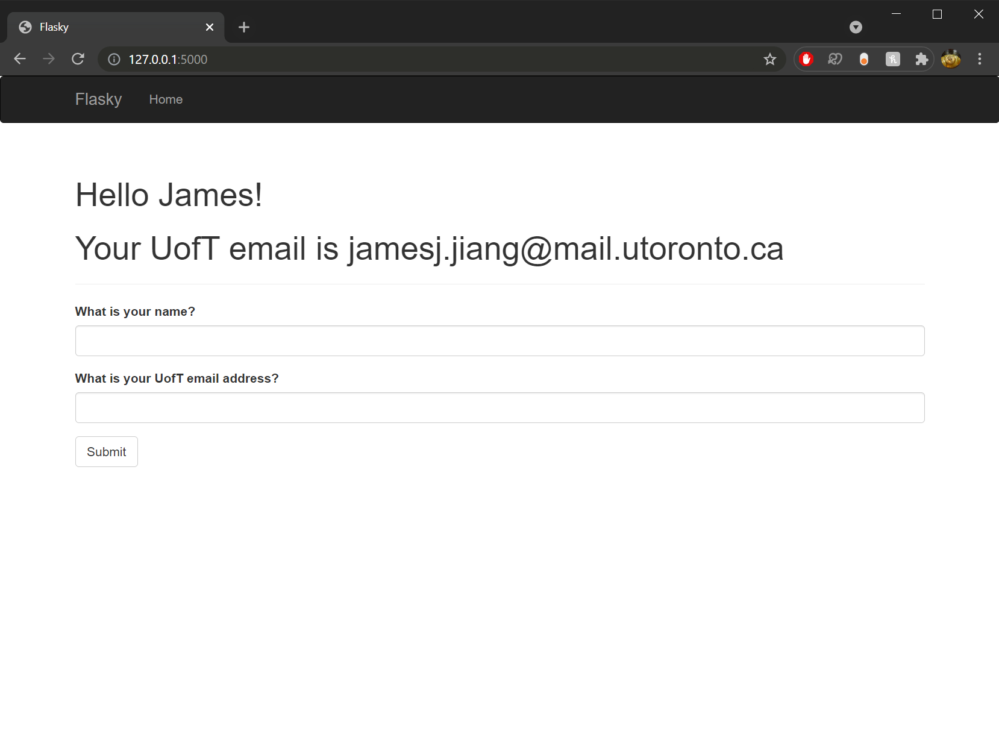
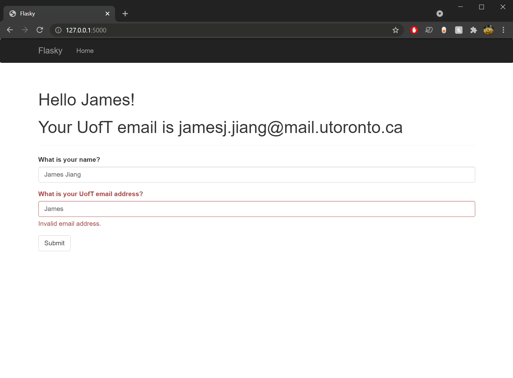
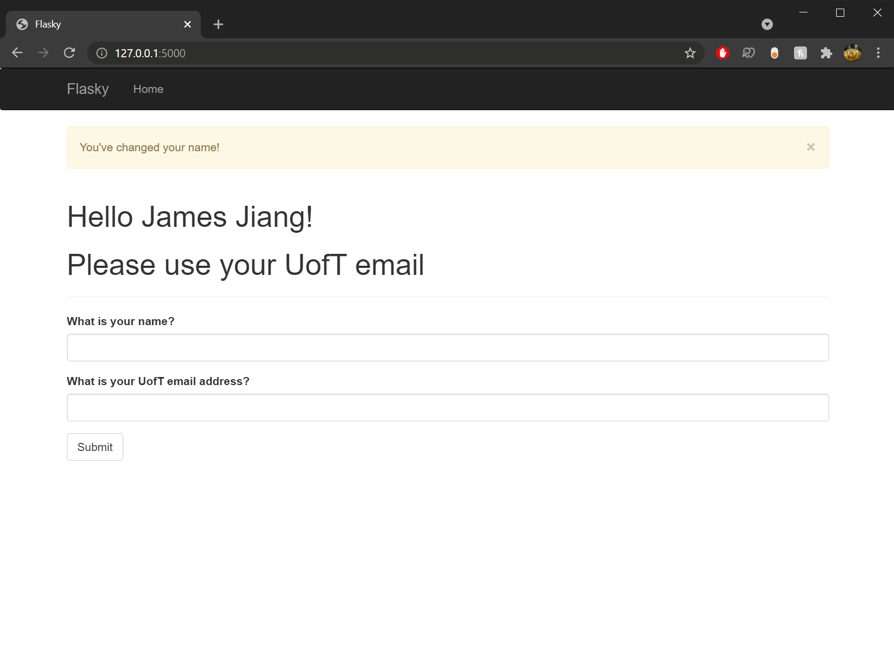

# ECE444-F2021-Lab2

This repo is a clone of https://github.com/miguelgrinberg/flasky.

## Activity 1
Completed virtualenv and flask installation:

## Activity 2
Basic user.html with name:

## Activity 3
user.html using Bootstrap, with navbar and timestamp:

## Activity 4
index.html with no form submission:

Submitted form with first name and UofT email address:

Submitted form with first and last name in 1st field and first name in 2nd field (error is expected):

Submitted form with first and last name in 1st field and non-UofT email in 2nd field:

